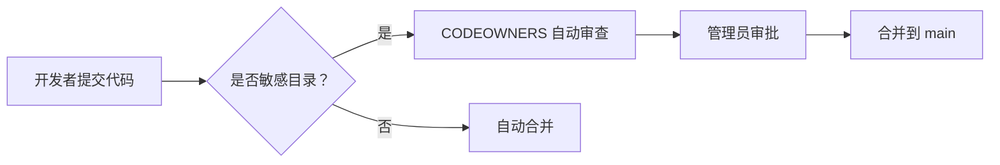

# VertaX 仓库管理指南

## 仓库可见性策略

**当前状态**：Public（公开）

**策略**：核心代码逻辑保持私有访问控制，marketing 页面对外公开

---

## 目录权限说明

###  公开目录（Public）

这些目录的代码对外可见，展示项目技术实力：

```
src/app/(marketing)/          # 官网营销页面
src/components/LandingPage.tsx
src/components/marketing/     # Marketing 组件
src/lib/design-tokens.ts      # 设计令牌
docs/                         # 项目文档
public/*.jpg                  # 公开资源
```

**用途**：
- 技术博客引用
- 开源社区展示
- 投资人尽调
- 开发者招聘

---

### 🔒 受保护目录（Protected）

这些目录包含核心业务逻辑，需要管理员审批：

```
src/app/customer/             # 租户端核心业务
src/app/dashboard/            # 决策中心
src/app/(tower)/              # 平台后台
src/lib/radar/                # 获客雷达核心
src/lib/marketing/            # 增长系统核心
src/lib/email/                # 邮件系统
src/lib/ai/                   # AI 核心逻辑
src/app/api/                  # API 接口
prisma/                       # 数据库模型
src/actions/                  # 服务端动作
```

**访问控制**：
- GitHub CODEOWNERS 强制审查
- 只有管理员可以合并 PR
- 外部贡献者无法查看敏感逻辑

---

## 如何实施访问控制

### 方案 1：保持 Public（推荐当前阶段）

**配置**：
1. 设置 CODEOWNERS 文件（已配置）
2. 开启分支保护（Branch Protection）
3. 要求 PR 审查（Require PR Review）

**优点**：
- 技术品牌建设
- 吸引人才和投资
- 开源营销素材

**操作**：
```bash
# 1. GitHub Settings → Branches → Add rule
# Branch name pattern: main
# ✅ Require a pull request before merging
# ✅ Require approvals (1)
# ✅ Require review from Code Owners
```

---

### 方案 2：转为 Private（未来选项）

**时机**：
- 产品正式发布
- 有融资计划
- 核心算法需要保护

**步骤**：
1. GitHub Settings → Danger Zone → Change visibility
2. 确认 Vercel 部署正常
3. 更新 README 移除"开源"描述
4. 通知现有协作者

**Vercel 部署**：
- 不受影响（OAuth Token 仍然有效）
- 如遇问题：Settings → Git → Reconnect

---

### 方案 3：混合模式（高级）

**描述**：
- 创建 `vertax-public` 仓库（marketing 页面）
- 创建 `vertax-private` 仓库（核心代码）
- 通过 Git Submodule 或 Monorepo 管理

**不推荐原因**：
- 部署复杂
- 代码复用困难
- 版本管理混乱

---

## 安全最佳实践

### 1. 环境变量管理

**永远不要提交**：
```bash
.env
.env.local
.env.production
*.pem
*.key
credentials.json
```

**使用 GitHub Secrets**：
```yaml
# .github/workflows/deploy.yml
env:
  DATABASE_URL: ${{ secrets.DATABASE_URL }}
  NEXTAUTH_SECRET: ${{ secrets.NEXTAUTH_SECRET }}
```

### 2. API Key 保护

**检查清单**：
- [ ] 所有 API Key 都在环境变量中
- [ ] 没有硬编码在代码里
- [ ] 使用 `.gitignore` 排除敏感文件
- [ ] 定期轮换密钥

### 3. 代码审查流程



---

## 对外展示策略

### 推荐展示的代码

✅ **可以公开**：
- LandingPage.tsx（官网设计）
- design-tokens.ts（设计系统）
- SEO 优化代码
- 组件库（UI Components）
- 项目文档

❌ **不建议公开**：
- 客户数据模型
- AI 提示词细节
- 第三方 API 集成代码
- 商业逻辑实现
- 内部工具脚本

### README 优化建议

**公开时**：
```markdown
# VertaX - GTM Intelligence OS

🌍 面向中国企业出海的智能获客平台

## 技术栈
- Next.js 16 + TypeScript
- Prisma + PostgreSQL
- TailwindCSS + Radix UI

## 本地开发
npm install
npm run dev

## 开源协议
MIT License
```

**私有化时**：
```markdown
# VertaX - GTM Intelligence OS

🔒 私有项目 - 仅限授权人员访问

## 技术栈
（保持相同）

## 本地开发
（保持相同，需配置 .env）
```

---

## 决策检查清单

### 是否应该私有化？

- [ ] 产品已正式发布
- [ ] 有明确的商业模式
- [ ] 核心算法需要保护
- [ ] 投资人建议私有化
- [ ] 竞争对手可能抄袭

### 是否保持公开？

- [ ] 需要技术品牌建设
- [ ] 准备融资（尽调加分项）
- [ ] 招聘开发者
- [ ] 建立行业影响力
- [ ] 代码没有核心商业机密

---

## 联系管理员

如有权限相关问题，请联系：
- GitHub: @ryan823-dev
- Email: contact@vertax.top

---

**最后更新**：2026-04-08
**维护者**：VertaX 技术团队
